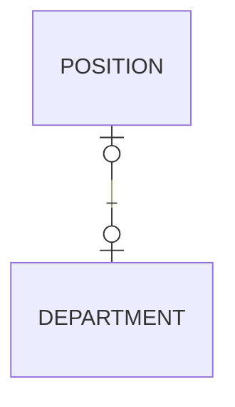

# Databse First approach in MS SQL Server Documentation


## Create Tables as usual

- Nuget Packages:
    - Microsoft.EntityFrameworkCore
    - Microsoft.EntityFrameworkCore.Design
    - Microsoft.EntityFrameworkCore.SqlServer
    - Microsoft.EntityFrameworkCore.Tools

- Command in PM (Package Manager)
    - `Scaffold-DbContext "Server=.; Database=DBNAMEX; trusted_connection=True;" Microsoft.EntityFrameworkCore.SqlServer -OutputDir DB`
    Working locally:
    - `Scaffold-DbContext "Server=YOURPC\SQLEXPRESS; Database=DBNAMEX; TrustServerCertificate=True; user id=admin;password=passw0rd" Microsoft.EntityFrameworkCore.SqlServer -OutputDir DB`

## Linq exp for 2 tables with shared id



```cs
    var listPositionDepartment = (
        from position in db.Positions
        join department in db.Departments on position.DepartmentId equals department.Id
        select new PositionDepartmentDto
        {
            PositionID = position.Id,
            PositionName = position.PositionName,
            DepartmentId = position.DepartmentId,
            DepartmentName = department.DepartmentName
        }
    ).ToList();
```

## MISC

- `TrustServerCertificate=True` Data
    - [https://stackoverflow.com/questions/17615260/the-certificate-chain-was-issued-by-an-authority-that-is-not-trusted-when-conn]